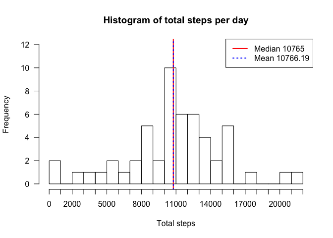
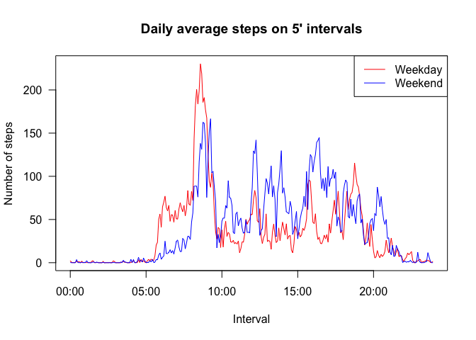

# Reproducible Research: Peer Assessment 1
rcblt@github.com  

## Introduction

This analysis uses data from a personal activity monitoring device that have been downloaded from [Activity Monitoring Data](https://d396qusza40orc.cloudfront.net/repdata%2Fdata%2Factivity.zip).  
As required by the assessment instructions this report is based on a fork of [this](https://github.com/rdpeng/RepData_PeerAssessment1) GitHub repository.


## Required packages

This report make use of the following R packages. We assume they are already installed and working.

```r
library(dplyr)
```

```
## 
## Attaching package: 'dplyr'
## 
## The following object is masked from 'package:stats':
## 
##     filter
## 
## The following objects are masked from 'package:base':
## 
##     intersect, setdiff, setequal, union
```

```r
library(lubridate)
```

## Loading and preprocessing the data

Source data comes in the form of a comma-separated text file named `activity.csv` that is loaded in the data frame `activity`. It's assumed that the `activity.csv` is in the current working directory.


```r
activity <- read.csv("activity.csv", 
                     colClasses=c("integer", "Date", "integer"), 
                     header= TRUE, 
                     as.is= TRUE)
```

To make the following analysis and plotting easier we add the column `minutes` that contains the `interval` value converted in minutes


```r
activity <- activity %>%
  mutate(minutes= (interval %/% 100)*60 + interval%%100)
```

These are few sample lines of the resulting data frame


```r
activity[5000:5010,]
```

```
##      steps       date interval minutes
## 5000   757 2012-10-18      835     515
## 5001   608 2012-10-18      840     520
## 5002   568 2012-10-18      845     525
## 5003   571 2012-10-18      850     530
## 5004   355 2012-10-18      855     535
## 5005    55 2012-10-18      900     540
## 5006    32 2012-10-18      905     545
## 5007    79 2012-10-18      910     550
## 5008    49 2012-10-18      915     555
## 5009     0 2012-10-18      920     560
## 5010     0 2012-10-18      925     565
```

## What is mean total number of steps taken per day?

In order to generate an histogram of the total number of steps taken each day we filtered out NA values, then grouped by the column `date` and take the sum of the recorded `steps`. 

Then we plot the histogram along with the **median** and **mean** that are represented as vertical lines in the plot.  


```r
totalStepsByDay <- activity %>% 
  filter(!is.na(steps)) %>% 
  group_by(date) %>% 
  summarise(total = sum(steps))
hist(totalStepsByDay$total, 
     breaks= 20, 
     main= "Histogram of total steps per day", 
     xlab= "Total steps",
     xaxp= c(0, 22000, 22),
     yaxp= c(0, 12, 6),
     ylim= c(0, 12),
     las= 1)
legend("topright", 
       legend= c(paste("Median", median(totalStepsByDay$total)), 
                 paste("Mean", round(mean(totalStepsByDay$total), 2))), 
       lty= c("solid", "dotted"), 
       col= c("red", "blue"), 
       lwd= 2)
abline(v= median(totalStepsByDay$total), col= "red", lwd= 2)
abline(v= mean(totalStepsByDay$total), col= "blue", lty= "dotted", lwd= 2)
```

 

The average number of steps taken daily is 10766.19 and the median is 10765.

## What is the average daily activity pattern?

First we filtered out NA values, then grouped the `activity` data by the column `minutes` and then computed the **mean** of the steps for each time interval. Finally, we added a new column `hm`  containing the hours and minutes of the interval represented as a character string 'hh:mm' for prettier plotting of the horizontal axis labels.
The interval where there is the maximum average number of steps is obtained as well.


```r
dailyAverageSteps <- activity %>% 
  filter(!is.na(steps)) %>% 
  group_by(minutes) %>% 
  summarise(average= mean(steps)) %>%
  mutate(hm= sprintf("%d:%02d", minutes %/% 60, minutes %% 60))

maxInterval <- dailyAverageSteps[which.max(dailyAverageSteps$average),]$hm

with(dailyAverageSteps, 
     plot(strptime(hm, "%H:%M"), average, 
          type= "l",
          main= "Daily average steps on 5' intervals",
          xlab= "Interval",
          ylab= "Number of steps",
          las= 1))
legend("topright", 
       legend= paste("Max average @", 
                     maxInterval, 
                     "=", 
                     round(dailyAverageSteps[dailyAverageSteps$hm== maxInterval,]$average, 2)))
```

 

The maximum of the average number of steps is 206.17 at interval 8:35. 

## Imputing missing values


```r
naRows <- activity %>% filter(is.na(steps)) %>% count()
```

The source data set contains 2304 rows with value NA for the `steps` column.

We decided to replace NA values with the average number of steps for that interval across all days. The number is rounded to the closest integer. The new dataset is `imputedActivity`.


```r
imputedActivity <- left_join(activity, dailyAverageSteps, by= "minutes") %>% 
  mutate(newSteps= ifelse(is.na(steps), round(average, 0), steps)) %>%
  select(newSteps, date, interval) %>% 
  rename(steps= newSteps) %>%
  mutate(minutes= (interval %/% 100)*60 + interval%%100)
```

This is the same histogram plot as before with imputed missing values


```r
imputedTotalStepsByDay <- imputedActivity %>% 
  filter(!is.na(steps)) %>% 
  group_by(date) %>% 
  summarise(total = sum(steps))

hist(imputedTotalStepsByDay$total, 
     breaks= 20, 
     main= "Histogram of total steps per day", 
     xlab= "Total steps",
     xaxp= c(0, 22000, 22),
     yaxp= c(0, 18, 9),
     ylim= c(0, 18),
     las= 1)
legend("topright", 
       legend= c(paste("Median", median(imputedTotalStepsByDay$total)), 
                 paste("Mean", round(mean(imputedTotalStepsByDay$total), 2))), 
       lty= c("solid", "dotted"), 
       col= c("red", "blue"), 
       lwd= 2)
abline(v= median(imputedTotalStepsByDay$total), col= "red", lwd= 2)
abline(v= mean(imputedTotalStepsByDay$total), col= "blue", lty= "dotted", lwd= 2)
```

 

This time the average number of steps taken daily is 10766.19 and the median is 10765.

The follwing table summarise mean and average values before and after imputing NA values.

Data Source | Median | Mean
------------|--------|------
Original data | 10765 | 10766.19
Imputed data | 10762 | 10765.64

Even though there is no big change in the above values in the two data sets the number of days where the steps taken were around the median value increased from 10 to 18 as clearly shown by the compared histograms in the following plot.


```r
hist(imputedTotalStepsByDay$total, 
     breaks= 20, 
     main= "Histogram of total steps per day", 
     xlab= "Total steps",
     xaxp= c(0, 22000, 22),
     yaxp= c(0, 18, 9),
     ylim= c(0, 18),
     las= 1)
hist(totalStepsByDay$total, 
     breaks= 20, 
     xaxp= c(0, 22000, 22),
     yaxp= c(0, 18, 9),
     ylim= c(0, 18), 
     col= rgb(0, 0, 0, 0.1), 
     add= TRUE)
legend("topright",
       legend= c("Original data", "Imputed NAs"),
       text.col= c(rgb(0, 0, 0, 0.5), "black")
       )
```

 

## Are there differences in activity patterns between weekdays and weekends?

First we addeda new column `day` to the `imputedActivity` data frame. It's a factor containing the values `Weekend` or `Weekday` depending on which day the data have been collected.

Then, we grouped first by `day` and then by `minutes` and finally we took the mean of the number of steps across all days at for each time interval.  
As done previously we also added the column `hm` for better printing the x axis labels.

Finally, we made two plots of the number of steps during the day, one for the weekends and one for the weekdays.


```r
workingDays <- 2:6

weekdayActivity <- imputedActivity %>% 
  mutate(day= factor(wday(date) %in% workingDays, 
                     levels= c(FALSE, TRUE), 
                     labels= c("Weekend", "Weekday"))
         )

weekdayAverageSteps <- weekdayActivity %>%
  group_by(day,minutes) %>%
  summarise(average= mean(steps)) %>%
  mutate(hm= sprintf("%d:%02d", minutes %/% 60, minutes %% 60))

par(mfrow= c(2, 1))
with(subset(weekdayAverageSteps, day== "Weekend"), 
     plot(strptime(hm, "%H:%M"), 
          average, 
          type= "l",
          main= "Daily average steps on 5' intervals",
          ylab= "Number of steps",
          xlab= "Interval (weekend)",
          ylim= c(0, 250),
          yaxp= c(0, 250, 5),
          las= 1
          ))

with(subset(weekdayAverageSteps, day== "Weekday"), 
     plot(strptime(hm, "%H:%M"), 
          average, 
          type= "l",
          ylab= "Number of steps",
          xlab= "Interval (weekday)",
          ylim= c(0, 250),
          yaxp= c(0, 250, 5),
          las= 1
          ))
```

 

Plotting the two graphs together can help to better show the different pattern of steps taken during the day on weekends and weekdays.


```r
with(subset(weekdayAverageSteps, day== "Weekday"), 
     plot(strptime(hm, "%H:%M"), 
          average, 
          type= "l",
          main= "Daily average steps on 5' intervals",
          ylab= "Number of steps",
          xlab= "Interval",
          col= "red",
          las= 1
          ))
with(subset(weekdayAverageSteps, day== "Weekend"),
     lines(strptime(hm, "%H:%M"),
           average,
           type= "l",
           col= "blue"))
legend("topright", 
       legend= c("Weekday", "Weekend"), 
       col= c("red", "blue"), 
       lwd= 1)
```

 

